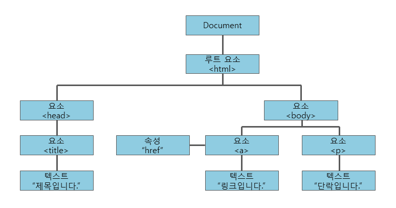

### 문서 객체 모델(DOM)이란?

문서 객체 모델(DOM, Document Object Model)은 HTML 문서나 XML 문서에 접근하기 위한 일종의 인터페이스 입니다.
이 모델은 문서 내의 모든 요소의 목적과 특징을 정의하고, 각각의 요소에 접근하는 방법 등을 제공합니다.



AJax에서는 이러한 DOM을 이용하여 웹 페이지의 일부분만을 변경할 수 있습니다.
따라서 AJax를 배우기 전에 DOM에 대한 기본적인 사항을 알아야만 합니다.

---

### DOM 요소의 선택

자바스크립트로 DOM 요소를 다루기 위해서는 우선 해당 요소를 선택해야만 합니다.
DOM 요소를 선택하는 방법은 다음과 같습니다.

1. 태그 이름(tag name)을 이용한 선택
2. 아이디(id)를 이용한 선택
3. 클래스(class)를 이용한 선택
4. CSS 선택자(selector)를 이용한 선택
5. HTML 객체 집합(object collection)을 이용한 선택

---

### DOM 요소 내용의 변경

 DOM을 이용하면 DOM 요소의 내용(Content)이나 속성값 등을 손쉽게 변경할 수 있습니다.
 
 DOM 요소의 내용을 바꾸는 가장 쉬운 방법은 innerHTML 프로퍼티를 이용하는 것입니다.
 또한, DOM 요소의 속성 이름을 이용하면 속성값을 바로 변경할 수도 있습니다.
 
 ---
 
 ### DOM API
 
 AJax를 이용하여 웹 페이지의 일부분만을 갱신하려면 더욱 다양한 DOM 속성을 활용해야 합니다.
 따라서 DOM과 관련된 다양한 API를 이용하여 노드를 동적으로 생성하고, 조작할 수 있어야 합니다.
 
---

### 노드의 추가

1. appendChild() : 새로운 노드를 해당 노드의 자식 노드 리스트에 맨 마지막 노드로 추가함
2. insertBefore() : 새로운 노드를 특정 노드 바로 앞에 추가함
3. insertData() : 텍스트 노드의 텍스트 데이터에 새로운 데이터를 추가함

다음 예제는 appendChild() 메소드를 이용하여 노드를 추가하는 자바스크립트 예제입니다.

```
function appendNode() {
    var parent = document.getElementById("list");  // 아이디가 "list"인 요소를 선택함.
    var newItem = document.getElementById("item"); // 아이디가 "item"인 요소를 선택함.
    parent.appendChild(newItem);                   // 해당 요소의 맨 마지막 자식 노드로 추가함.
}
```

---

### 노드의 생성

생성할 노드의 종류에 따라 다음과 같은 메소드를 사용할 수 있습니다.

1. createElement() : 새로운 요소 노드를 생성함.
2. createAttribute() : 새로운 속성 노드를 생성함.
3. createTextNode() : 새로운 텍스트 노드를 생성함.

다음 예제는 createElement() 메소드를 이용하여 노드를 생성하는 노드를 생성하는 자바스크립트 예제입니다.

```
function createNode() {
    var criteriaNode = document.getElementById("text"); // 기준이 되는 요소로 아이디가 "text"인 요소를 선택함.
    var newNode = document.createElement("p");          // 새로운 <p> 요소를 생성함.
    newNode.innerHTML = "새로운 단락입니다.";
    document.body.insertBefore(newNode, criteriaNode);  // 새로운 요소를 기준이 되는 요소 바로 앞에 추가함.
}
```

---

### 노드의 제거

다음 메소드를 사용하면 특정 노드를 제거할 수 있습니다.

1. removeChild() : 기존의 노드 리스트에서 특정 노드를 제거함
2. removeAttribute() : 속성의 이름을 이용하여 특정 속성 노드를 제거함

다음 예제는 removeChild() 메소드를 이용하여 노드를 제거하는 자바스크립트 예제입니다.

```
var parent = document.getElementById("list");      // 아이디가 "list"인 요소를 선택함.
var removedItem = document.getElementById("item"); // 아이디가 "item"인 요소를 선택함.
parent.removeChild(removedItem);                   // 지정된 요소를 삭제함.
```

---

### 노드의 복사

cloneNode() 메소드를 사용하면 특정 노드를 복제할 수 있습니다.

다음 예제는 cloneNode() 메소드를 사용하여 노드를 복제하는 자바스크립트 예제 입니다.

```
function cloneElement() {
    var parent = document.getElementById("list");     // 아이디가 "list"인 요소를 선택함.
    var originItem = document.getElementById("item"); // 아이디가 "item"인 요소를 선택함.
    parent.appendChild(originItem.cloneNode(true));   // 해당 노드를 복제하여 리스트의 맨 마지막에 추가함.
}
```

---

### 노드의 값 변경

nodeValue 프로퍼티를 사용하면 특정 노드의 값을 변경할 수 있습니다.
또한, setAttribute() 메소드는 속성 노드의 속성값을 변경할 수 있게 해줍니다.

다음 예제는 nodeValue 프로퍼티를 이용하여 노드를 생성하는 자바스크립트 예제입니다.

```
var para = document.getElementById("text"); // 아이디가 "text"인 요소를 선택함.
function changeText() {
    para.firstChild.nodeValue = "텍스트 변경 완료!";
}
```

---

### 노드의 교체

replaceChild() 메소드를 사용하면 특정 노드 그 자체를 다른 노드로 바꿀 수 있습니다.

다음 예제는 replaceChild() 메소드를 이용하여 노드를 교체하는 자바스크립트 예제입니다.

```
var parent = document.getElementById("parent"); // 부모 노드를 선택함.
var first = document.getElementById("first");
var third = document.getElementById("third");
function changeNode() {
    parent.replaceChild(third, first);          // first 요소를 삭제하고, 그 대신 third 요소를 삽입함.
}
```

> 서버 통신에 대해 알아보기 : <https://github.com/wschoi8640/AJAX/blob/master/ServerClient.md>
