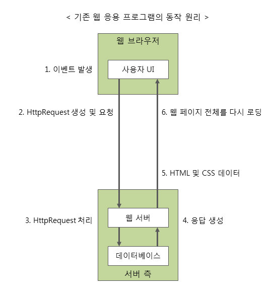
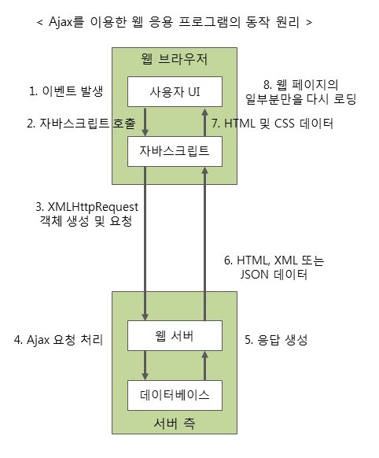

### AJax란?

AJax란 Asynchronous JavaScript and XML 의 약자입니다.
AJax는 빠르게 동작하는 동적인 웹 페이지를 만들기 위한 개발 기법의 하나입니다.

AJax는 웹페이지 전체를 다시 로딩하지 않고도, 웹 페이지 일부분만을 갱신할 수 있습니다.
AJax를 사용하면 백그라운드 영역에서 서버와 통신하여, 그 결과를 웹페이지 일부분에 표시할 수 있습니다.

이 때 서버와는 다음과 같은 다양한 데이터를 주고 받을 수 있습니다.

- JSon
- XML
- HTML
- 텍스트 파일

---

### AJax의 장점

AJax를 이용하면 다음과 같은 장점이 있습니다.

1. 웹페이지 전체를 다시 로딩하지 않고도, 웹 페이지의 일부분만을 갱신 할 수 있습니다.
2. 웹페이지가 로드된 후에 서버로 데이터 요청을 보낼 수 있습니다.
3. 웹페이지가 로드된 후에 서버로부터 데이터를 받을 수 있습니다.
4. 백그라운드 영역에서 서버로 데이터를 보낼 수 있습니다.

---

### AJax의 한계

AJax를 이용하면 여러 장점을 가지지만, AJax로 다음과 같은 일은 처리할 수 없습니다.

1. AJax는 클라이언트가 서버에 데이터를 요청하는 클라이언트 풀링 방식을 사용하므로, 서버 푸시 등의 실시간 서비스는 만들수 없습니다.
2. AJax로는 바이너리 데이터를 보내거나 받을 수 없습니다.
3. AJax 스크립트가 포함된 서버가 아닌 다른 서버로 AJax요청을 보낼 수 없습니다.
4. 클라이언트의 PC로 AJax 요청을 보낼 수 없습니다.

- 클라이언트 풀링 : 사용자가 직접 원하는 정보를 서버에 요청하는 방식
- 서버 푸시 : 사용자가 요청하지 않아도 서버가 알아서 자동으로 특정 정보를 제공하는 것

---

### AJax 구성요소

AJax는 기존에 사용되던 여러 기술을 함께 사용하여, 웹 페이지의 일부분만을 갱신할 수 있도록 해주는 개발 기법입니다.
이러한 AJax에서 사용하는 기존 기술은 다음과 같습니다.

- 웹 페이지 표현을 위한 HTML과 CSS
- 데이터에 접근하거나 화면 구성을 동적으로 조작하기 위해 사용되는 DOM 모델
- 데이터의 교환을 위한 JSON이나 XML
- 웹 서버와의 비동기식 통신을 위한 XMLHttpRequest 객체
- 위에서 언급한 모든 기술을 결합하여 사용자의 작업 흐름을 제어하는데 사용되는 자바스크립트

---

### AJax 동작 원리

AJax의 동작은 위에서 언급한 AJax 구성 요소들을 사용하여 이루어집니다.

AJax를 이용한 웹 응용 프로그램은 자바스크립트 코드를 통해 웹 서버와 통신을 하게 됩니다.
따라서 사용자의 동작에는 영향을 주지 않으면서도 백그라운드에서 지속해서 서버와 통신할 수 있습니다.

다음 그림은 Ajax를 이용한 웹 응용 프로그램과 기존의 웹 응용 프로그램의 동작 원리를 간략히 보여주고 있습니다.

'AJax를 이용한 웹 응용 프로그램의 동작 원리'는 다음과 같은 순서로 진행됩니다.

1. 사용자에 의해 요청 이벤트가 발생합니다.
2. 요청 이벤트가 발생하면 이벤트 핸들러에 의해 자바스크립트가 호출됩니다.
3. 자바스크립트는 XMLHttpRequest 객체를 사용하여 서버로 요청을 보냅니다.
   이 때 웹 브라우저는 요청을 보내고 나서, 서버의 응답을 기다릴 필요 없이 다른 작업을 처리할 수 있습니다.
4. 서버는 전달받은 XMLHttpRequest 객체를 가지고 Ajax 요청을 처리합니다.
5 && 6. 서버는 처리한 결과를 HTML, XML 또는 JSON 형태의 데이터로 웹 브라우저에 전달합니다.
        이 때 전달되는 응답은 새로운 페이지를 전부 보내는 것이 아니라 필요한 데이터만을 전달합니다.
7. 서버로부터 전달받은 데이터를 가지고 웹페이지의 일부분만을 갱신하는 자바스크립트를 호출합니다.
8. 결과적으로 웹 페이지의 일부분만이 다시 로딩되어 표시됩니다.

> DOM 에 대해 알아보기 : <https://github.com/wschoi8640/AJAX/blob/master/DOM.md>
